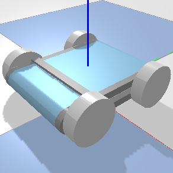
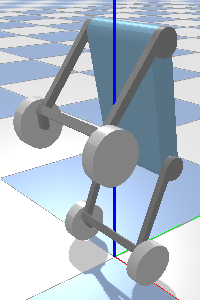

# Slab Robot
Work in progress...

## Mechanical Design

[OnShape CAD Document](https://cad.onshape.com/documents/01b7bf47ac0296002ad3efc0/w/656ec7f127d0c64f6943908d/e/5454fd1cd4994d1435836e10)


## Simulation




[Onshape to Robot](https://onshape-to-robot.readthedocs.io/) is used to generate robot simulation URDF files based on the concept assembly CAD.

```bash
# generate urdf
sudo apt install openscad meshlab # install system dependencies
pip install onshape-to-robot # install python application

# generate and output to urdf directory based on urdf/config.json
onshape-to-robot urdf 
```

Run the following commands (or the equivalent on your system) to setup:

```bash
# install system dependencies
sudo apt install cmake gcc python3
# Install pytohn dependencies:
pip3 install -r requirements.txt

#### Build controller library
cd controller
mkdir build
cd build
cmake ..
make
cd ../..
```

To start, execute `./sim.py`. A connected USB gamepad is required.

The controls are:

- Home button resets simulation.
- Select button recenters camera.
- Left stick controls wheels.
  - X-axis controls turning velocity.
  - Y-axis controls forward velocity.
  - D-pad scaled by L-trigger maps to left stick controls.
- Right stick controls legs.
  - X-axis controls rotation of both legs in the same direction.
  - Y-axis controls rotation of both legs in different directions.
  - Diagonal axis controls individual legs.
  - Buttons scaled by R-trigger maps to right stick controls.
- Holding R button maps right stick to leg position presets.
  - Up maps U preset.
  - Down maps to inverted U preset.
  - Left maps to fully unfolded preset.
  - Right maps to fully folded preset.
- Holding L button disables balance controller.
- Balance controller automatically engages when one pair of legs are detected to be off the ground.


