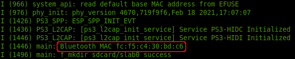

# Firmware Setup

## Hardware
### ESP32-CAM
- ***First check if VDD is connected to 5V or 3.3V***.
- remove resistors to flash LED, its the one right below the voltage selectors.

### PS3 Gamepad
Find the bluetooth MAC address of the ESP32 in UART prints during boot.



Then configure the PS3 gamepad to connect to that MAC address by following [Sixaxis USB pairing](https://help.ubuntu.com/community/Sixaxis#USB_Pairing).

Once MAC is configured. Press gamepad home button to turn on and connect.

*If gamepad disconnects, reconnect by holding home button to turn off and turn back on again. There is a known issue where reconnect only works on the second attempt.*

### CAN Troubleshoot
- Measure resistance across CANH and CANL to verify 60Ω of the combined termination resistors on each end.
- Check that all devices on the bus is configured to the same baudrate.

#### For ESP32 side refer to [CAN Peripheral Doc](https://docs.espressif.com/projects/esp-idf/en/latest/esp32s2/api-reference/peripherals/twai.html).
- Verify that the setup works using [Loopback Self Test](https://github.com/espressif/esp-idf/tree/master/examples/peripherals/twai/twai_self_test).
- Check that the correct message ID filters are applied.

#### For ODrive side refer to [CAN Protocol Doc](https://docs.odriverobotics.com/can-protocol).
- By default, constant heartbeat messages are sent at 10Hz. This can be verified by measuring voltage across CANH and CANL. The expected value is ~1.57V assuming equal distribution of 1's and 0's corresponding to differential voltages of 0V and 3.3V.
- CAN is turned off via setting :

- ```
  odrv0.config.enable_can_a = False
  odrv0.save_configuration()
  odrv0.reboot()
  ```
Then the expected differential voltage across CANH and CANL is either 0V or 3.3V.

- Check that the DIP switch for toggling termination resistor is set correctly.
- Check that all devices on bus is configured to a unique node ID.

#### For SN65HVD230 Module refer to [Datasheet](https://www.ti.com/lit/ds/symlink/sn65hvd230.pdf).
- It's basically a glorified comparator circuit. To test functionality, first apply HIGH and LOW on TX pin and verify differential voltage of 0 and VDD across CAN lines, then vice versa apply 0 and VDD differntial voltage across CAN lines and verify RX pin is driven HIGH and LOW.
- The modules includes a 120Ω termination resistor by default, desolder to remove.
- Doesn't require pullups unless GPIO is open-drain.
- 0.1uF decoupling capacitor recommended.
- Cheap chinese sourced parts may be fake and disfunctional so test them first.


# ESP32
Follow the getting started guide in
[Official ESP-IDF Docs](https://docs.espressif.com/projects/esp-idf/en/stable/esp32/) to setup firmware development enviroment. Alternatively
[ESP-IDF Docker](https://hub.docker.com/r/espressif/idf) provides everything preconfigured.

```bash
docker pull espressif/idf:release-v4.3
```

## Configure
`./idf.sh menuconfig`

### Options
- Compiler Options / Optimization Level
  - Optimize for performance (-O2)
- Component Config / Driver Configurations / TWAI configuration
  - Place TWAI ISR function into IRAM
- Component Config / ESP32-Specific / CPU frequency
  - 240 MHz
- Component Config / ESP32-Specific / Support for external, SPI-connected RAM
  - False / True (ESP32-CAM has 4MB PSRAM but CS pin on IO16 might be used)
- Component Config / FreeRTOS / Enable FreeRTOS to collect run time stats
  - True
- Component Config / FreeRTOS / Enable display of xCoreID in vTaskList
  - True
- Component Config / Core dump / Data destination
  - Flash
- Component Config / ESP System Settings / Panic handler behaviour
  - Print registers and halt (Invoke GDBStub breaks flash coredump)
- [PS3 controller config](https://github.com/jvpernis/esp32-ps3#configuring-your-project)

## Build
`./idf.sh build`

## Flash
- connect usb serial to UART pins
- ground IO0 pin
- `idf.sh -p PORT [-b BAUD] flash`

## Serial Monitor
`idf.py monitor`

# MPU6050
